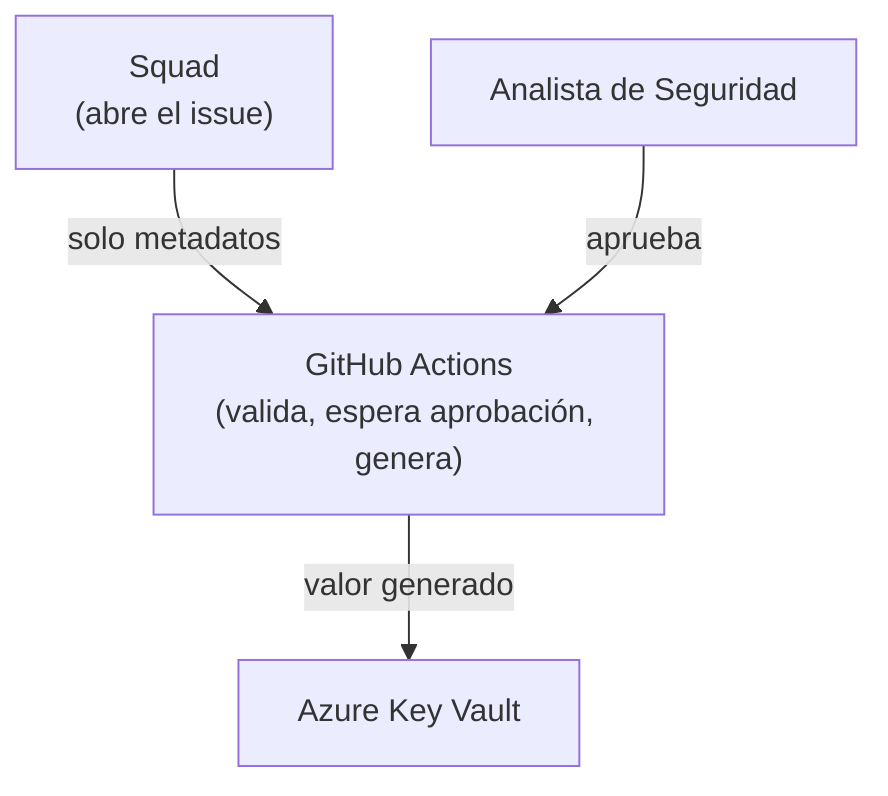
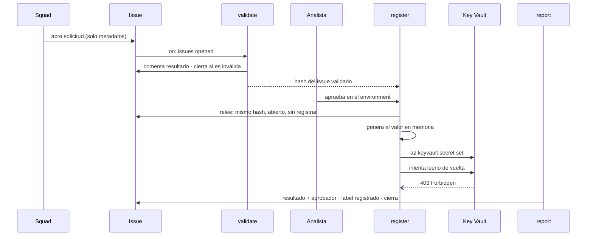

# Arquitectura

El valor va **directo de su origen a la bóveda, en un solo salto**, y quien lo escribe no puede
leerlo después. Es un solo flujo con dos ejecutores posibles en el paso de escritura: `github[bot]`
cuando el valor lo emite una API, o la persona que lo recibió cuando lo entrega un proveedor.

El control que esto resuelve es de **segregación de funciones**: quien pide el secreto no lo maneja,
quien aprueba no lo ve, y nadie necesita el portal de Azure para registrarlo.

## Estructura

```
.github/
├── ISSUE_TEMPLATE/
│   └── registro-secreto.yml      # formulario de solicitud — sin campo para el valor
├── workflows/
│   ├── registrar-secreto.yml     # validate → register (Azure) → report
│   └── conciliar-boveda.yml      # compara la bóveda contra los pedidos aprobados
└── scripts/
    ├── common.js                 # patrón del canario, labels y referencias compartidas
    ├── validar-solicitud.js      # check al abrir, recheck justo antes de escribir
    ├── generar-secreto.js        # genera el valor en el runner
    ├── reportar-registro.js      # resultado, aprobador real y cierre
    └── conciliar-boveda.js       # detecta secretos sin pedido y cierra los ya cargados
infra/
└── bootstrap.sh                  # todo lo de Azure, idempotente
```

Sin capas tipo `core/services/shared`: son cuatro scripts cortos. Lo compartido vive en `common.js`.

## Los tres planos



- **Personas** — el squad pide y el Analista aprueba. Ninguno toca el valor.
- **GitHub** — valida, orquesta y genera. El valor vive solo dentro de un step del runner.
- **Azure Key Vault** — el único lugar donde el valor queda guardado.

## Flujo



Todo ocurre en **un único issue**: pedido, validación, aprobación y resultado quedan en el mismo
hilo, así la trazabilidad se lee de corrido.

## Decisiones de diseño

**Un solo flujo, dos ejecutores.** Los secretos que entrega un proveedor —Salesforce, un banco, un
partner— no se pueden generar: cuando llegan, una persona ya los vio. Pretender que nadie los vea es
una promesa imposible, y dejarlos fuera de alcance dejaba afuera la mayor parte del problema real.

Lo que sí se puede garantizar en los dos casos es **el salto único**: el valor va de su origen a la
bóveda sin escalas, y quien lo escribe no puede releerlo. Por eso el flujo es uno y lo que cambia es
solo quién ejecuta la escritura. El formulario declara el origen y el workflow decide el camino.

**Las personas que cargan valores usan el mismo rol que `github[bot]`.** No son dos mecanismos
parecidos: es la misma definición de rol, asignada a un grupo de Entra ID. Eso es lo que permite
afirmar sin excepciones que quien escribe en la bóveda no puede leerla.

**El rol permite escribir, no leer.** Los roles integrados de Key Vault no sirven: *Secrets User*
solo lee y *Secrets Officer* hace todo, incluido `getSecret`. Con el integrado, el pipeline podría
releer lo que acaba de escribir. Por eso `bootstrap.sh` define un rol con **una sola dataAction**,
`Microsoft.KeyVault/vaults/secrets/setSecret/action`, y el workflow comprueba en cada corrida que la
lectura siga denegada. Si alguien amplía esos permisos, el registro falla y se nota.

**Identidad administrada, no App Registration.** El tenant donde corre este lab tiene
`allowedToCreateApps: false`, así que registrar una aplicación no era posible. Una *user-assigned
managed identity* es un recurso de la suscripción y admite credenciales federadas igual. Terminó
siendo la mejor opción por otro motivo: no hay ningún secreto de cliente que rotar ni que se pueda
filtrar — el ciclo de vida lo maneja Azure entero.

**El subject de OIDC se lee de la API, no se escribe a mano.** GitHub firma el token con los IDs
numéricos inmutables del dueño y del repo:
`repo:Ox19@57415456/poc-registry-secret-automation@1373060850:environment:registro-secretos`. Escribir
el nombre pelado hace fallar el login con `AADSTS700213`.

El subject lleva **nombre e ID a la vez**, así que **renombrar el repo o la cuenta rompe el login**:
hay que volver a correr `bootstrap.sh`, que lo relee de la API. Lo que el ID aporta es otra garantía:
nadie puede crear después un repo con el nombre viejo y heredar el permiso, porque tendría otro ID.

**El valor pasa por archivo, no por argumento.** `--value` dejaría el secreto en la línea de comandos,
visible para cualquier proceso del runner con `ps`. Va por un archivo temporal con permisos `600` y
un `trap` que lo borra pase lo que pase.

**Un solo workflow, disparado al abrir el issue.** `register` depende de `validate`: una solicitud
rechazada nunca llega a pedir aprobación. Editar el issue no la reprocesa; para corregir se abre otro.

**Lo aprobado es lo validado.** `validate` emite el hash del cuerpo del issue. `register` lo relee
justo antes de generar y aborta si cambió, si ya no está abierto o si tiene el label `registrado`.

**El environment va en el job que genera.** La aprobación pausa exactamente el job que crea el valor,
y el `sub` de OIDC solo se emite a un job que declare el environment. Un job que se saltee la
aprobación no obtiene un token que Azure acepte.

**Repositorio dedicado.** La credencial federada se acota a este repo y environment. En un repo
compartido, cualquier workflow podría pedir el token que escribe en el Key Vault.

**El control real no es el enmascarado.** `::add-mask::` tapa coincidencias exactas en los logs, pero
no un valor transformado ni una exfiltración deliberada — el runner tiene salida de red. Lo que
protege de verdad es **quién puede modificar estos archivos**. En este lab no hay `CODEOWNERS` ni
protección de rama: es de un solo dueño. En un entorno corporativo esa protección es obligatoria y
no opcional.

**El valor no sale de su step.** No va a `GITHUB_ENV` ni a un argumento: nace, se registra y muere en
el mismo step, lejos de las acciones de terceros de los pasos siguientes.

**El aprobador sale de la revisión, no de `github.actor`.** En un evento `issues`, `github.actor` es
quien abrió el issue, no quien aprobó.

**Acciones ancladas al SHA, no a la etiqueta.** Una etiqueta se puede reapuntar a otro código; un SHA
no. Estas acciones corren en el mismo job que genera el valor.

**Permisos mínimos por job.** `permissions: {}` a nivel global. `register`, el único job que tiene el
valor, no puede escribir en el issue; su `id-token: write` sirve solo para pedir el token de Azure.

**La conciliación tiene su propia identidad, sin permiso de escritura.** Corre sola, sin aprobación
humana — si no, cada corrida quedaría esperando que alguien la apruebe y el control no existiría. Por
eso no puede compartir identidad con el registro: si pudiera escribir, alguien podría registrar un
secreto por esa vía saltándose la aprobación. Su rol tiene una sola acción, `readMetadata`, que
permite listar nombres y **no** ver valores.

**El control es preventivo o detectivo según quién escriba.** Con `github[bot]` la aprobación es
imposible de saltear: sin ella no obtiene el token de Azure. Con una persona no, porque tiene el
permiso de forma permanente. Ahí el control es la conciliación: detecta después lo que no pudo
impedir antes. Es menos, y conviene decirlo, pero es mucho más que no tener ni pedido ni registro.

## Estado

Funciona contra un Azure real: login federado, escritura efectiva, lectura denegada, conciliación que
detecta secretos sin pedido, y cero apariciones del valor en logs y en el issue.

Falta el **grupo de custodios**: el tenant de la universidad no permite crear grupos de Entra ID, así
que la carga a mano está diseñada y documentada pero no probada con un grupo real. El permiso que
usaría es el mismo que ya está probado con `github[bot]`.

El valor que se registra es un canario con formato reconocible, no una credencial real.

## Fuera de alcance

- Detección inmediata de cargas fuera del flujo: la conciliación corre por horario, no por evento.
  Con Event Grid sobre el Key Vault sería inmediata; acá se eligió lo simple para la PoC.
- La **lectura** de secretos por las aplicaciones: es otra fase.
- Vencimiento y rotación: los secretos se registran **sin fecha de expiración**, siguiendo la
  práctica actual de la compañía. `az keyvault secret set` acepta `--expires` y el flujo lo
  soportaba, así que volver a activarlo es una línea el día que exista una política de rotación.
- Dependencias npm: los scripts usan solo módulos nativos de Node.
