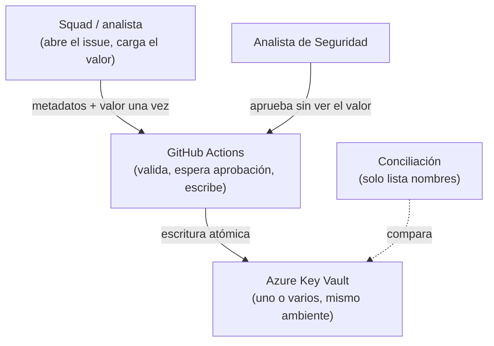
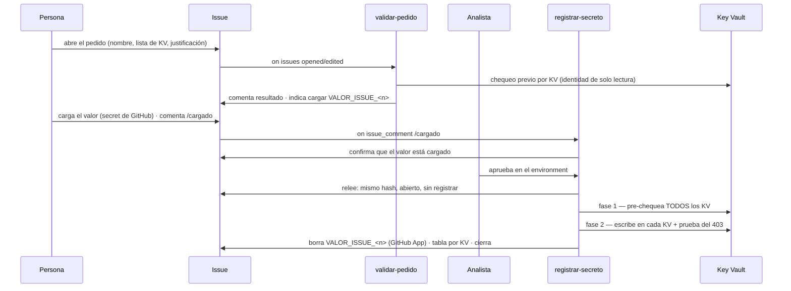

# Arquitectura

El valor va **directo de su origen a la bóveda, en un solo salto**, y quien lo escribe no puede leerlo
después. Todo entra por GitHub Actions: un solo carril, donde la persona que recibió el valor lo carga
una vez y `github[bot]` lo escribe en el Key Vault.

El control que esto resuelve es de **segregación de funciones**: quien pide el secreto no lo aprueba,
quien aprueba no lo ve, quien escribe no lo puede releer, y nadie necesita el portal de Azure.

## Estructura

```
.github/
├── ISSUE_TEMPLATE/
│   └── registro-secreto.yml      # formulario — sin campo para el valor; el KV admite varios
├── workflows/
│   ├── validar-pedido.yml        # al abrir/editar: valida + chequeo previo en Azure (no espera aprobación)
│   ├── registrar-secreto.yml     # con /cargado: confirma → aprobación → escribe → limpia → cierra
│   ├── barrer-secrets.yml        # cada hora: borra secrets de GitHub sueltos, cancela esperas viejas
│   └── conciliar-boveda.yml      # cada día: compara los KV contra los pedidos registrados
└── scripts/
    ├── common.js                 # bóvedas, labels, parseo del pedido y utilidades compartidas
    ├── validar-solicitud.js      # check al abrir, revalidate en /cargado, recheck antes de escribir
    ├── confirmar-carga.js        # confirma que el valor está cargado como secret de GitHub
    ├── reportar-registro.js      # tabla por KV, desenlace, aprobador real y cierre
    ├── barrer-secrets.js         # detecta y borra secrets de GitHub sin pedido abierto y fresco
    └── conciliar-boveda.js       # detecta secretos sin pedido y los pisados desde el portal
infra/
└── bootstrap.sh                  # todo lo de Azure, idempotente
```

Sin capas tipo `core/services/shared`: son scripts cortos. Lo compartido vive en `common.js`.

## Los planos



- **Personas** — el squad (o un analista) pide y carga el valor; **otro** analista aprueba (cuatro ojos).
- **GitHub** — valida, orquesta y escribe. El valor vive solo dentro de un step del runner.
- **Azure Key Vault** — el único lugar donde el valor queda guardado.

## Flujo



Todo ocurre en **un único issue**: pedido, validación, carga, aprobación y resultado quedan en el mismo
hilo, así la trazabilidad se lee de corrido.

## Decisiones de diseño

**Un solo carril, sin generar valores.** Siempre hay una persona que recibe el valor (de un proveedor o
de un sistema) y termina conociéndolo. Generarlo dentro del flujo no suma seguridad y confunde, así que
el flujo no lo hace: quien lo tiene lo carga una vez como secret de GitHub `VALOR_ISSUE_<n>`.

**Dos workflows, y la espera de aprobación nace con el `/cargado`.** GitHub **fija los secrets de una
corrida al crearla**: una corrida creada al abrir el issue nunca vería un valor cargado después. Por eso
`validar-pedido.yml` (validación + chequeo previo) va aparte y **no** espera aprobación, y
`registrar-secreto.yml` —la corrida que escribe— nace con el comentario `/cargado`, cuando el valor ya
existe. De paso, así es **imposible aprobar antes de que el valor exista**.

**Un secreto en varios KV, del mismo ambiente.** El campo Key Vault admite una lista; todos deben ser de
la misma letra (`d`/`c`/`p`). Un mismo valor se registra en todos bajo **una sola aprobación**, porque la
puerta de aprobación es por ambiente. Una lista mezclada se rechaza: es la red de seguridad ante el typo
`d`↔`p`.

**Escritura atómica por pre-chequeo, no por rollback.** Antes de escribir, se valida **cada** KV
(alcanzable, nombre libre) con la misma identidad que escribe; si uno solo falla, **no se escribe en
ninguno**. Deshacer escribiendo-y-borrando no sirve: exigiría darle permiso de borrado al pipeline
(rompe "quien escribe no puede leer ni borrar") y, con el *soft-delete* de Key Vault, dejaría el nombre
en la papelera. Como una transacción bancaria: primero se valida que todo puede cerrarse. Residual: una
carrera rarísima entre el pre-chequeo y la escritura queda en estado parcial, marcado con alerta.

**Un solo job con loop, no una matriz.** La escritura corre en un único job: un `environment` declarado =
**una sola aprobación**, y un solo `azure/login` da un token que sirve para todos los KV del mismo
ambiente. La matriz pediría una aprobación por celda o ambigüedad; el loop no.

**El rol permite escribir y ver nombres, no leer valores.** Los roles integrados no sirven: *Secrets
User* solo lee y *Secrets Officer* hace todo, incluido `getSecret`. Por eso `bootstrap.sh` define un rol
con **dos dataActions**, `setSecret` y `readMetadata`: escribe y lista nombres (para rechazar un nombre
que ya existe), pero nunca ve valores. El workflow comprueba en cada corrida, por KV, que la lectura
siga denegada (`403`); si algún día se puede leer, la corrida queda con **alerta de permisos**.

**Identidad federada, sin ningún secreto guardado.** GitHub firma un token y Azure lo valida contra una
credencial federada. No hay contraseña que rotar ni filtrar. Se usa una *user-assigned managed
identity*: el ciclo de vida lo maneja Azure entero.

**El subject de OIDC lleva nombre e ID.** GitHub firma el token con los IDs numéricos del dueño y del
repo: `repo:<owner>@<owner_id>/<repo>@<repo_id>:environment:<env>`. Con el nombre pelado, el login falla
con `AADSTS700213`. Como lleva el nombre, **renombrar el repo rompe el login** (hay que recorrer
`bootstrap.sh`); y como lleva el ID, nadie puede crear después un repo con el nombre viejo y heredar el
permiso.

**El valor pasa por archivo, no por argumento.** `--value` dejaría el secreto visible con `ps`. Va por
un archivo temporal con permisos `600` (uno solo, reutilizado para todos los KV) y un `trap` que lo
borra pase lo que pase. No va a `GITHUB_ENV` ni a un argumento: nace, se escribe y muere en el mismo
step.

**Lo aprobado es lo validado.** `revalidate` emite el hash del cuerpo del issue con el `/cargado`;
`recheck` lo relee justo antes de escribir y aborta si cambió, si ya no está abierto o si tiene el label
`registrado`.

**El environment va en el job que escribe.** La aprobación pausa exactamente ese job, y el token de OIDC
solo se emite a un job que declare el environment. Un job que se saltee la aprobación no obtiene un token
que Azure acepte. El aprobador sale de la **revisión** del environment, no de `github.actor` (que en un
evento de issue es quien lo abrió).

**El secret de GitHub se borra con una GitHub App.** El `GITHUB_TOKEN` del workflow **no puede** crear ni
borrar secrets. Una GitHub App con permiso sobre secrets sí; su llave vive en el environment `github-app`,
que quien carga valores no puede tocar. El borrado corre **salga como salga** la escritura.

**La conciliación tiene su propia identidad, sin permiso de escritura.** Corre sola, sin aprobación —si
no, cada corrida esperaría que alguien la apruebe y el control no existiría—. Por eso no comparte
identidad con el registro: si pudiera escribir, alguien registraría un secreto por esa vía saltándose al
analista. Su rol tiene una sola acción, `readMetadata`. Empareja por el par **(KV, nombre)** y es
consciente de la **lista** de un pedido multi-KV, así que un KV extra no se marca como huérfano.

**El control real no es el enmascarado.** `::add-mask::` tapa coincidencias exactas en los logs, pero no
un valor transformado ni una exfiltración deliberada —el runner tiene salida de red—. Lo que protege de
verdad es **quién puede modificar `scripts/` y `workflows/`**. Las acciones de terceros van **ancladas a
SHA** (una etiqueta se puede reapuntar) y los permisos son **mínimos por job**. En este lab, de un solo
dueño, no hay `CODEOWNERS` ni protección de rama; en un entorno corporativo esa protección es obligatoria.

## Estado

Funciona contra un Azure real: login federado, escritura efectiva en uno o varios KV, lectura denegada
(`403`) por KV, escritura **atómica** (nada a medias si un KV falla), conciliación que detecta secretos
sin pedido y es consciente de la lista, y cero apariciones del valor en logs y en el issue. Verificado
con las pruebas STD-01 a STD-05.

El valor que se registra es un canario con formato reconocible, no una credencial real.

## Fuera de alcance

- Generación de valores: siempre los carga una persona.
- Detección inmediata de cargas fuera del flujo: la conciliación corre por horario, no por evento. Con
  Event Grid sobre el Key Vault sería inmediata.
- La **lectura** de secretos por las aplicaciones: es otra fase.
- Vencimiento y rotación: los secretos se registran **sin fecha de expiración**, siguiendo la práctica
  actual de la compañía. Volver a activarlo es una línea (`--expires`) el día que exista una política.
- Dependencias npm: los scripts usan solo módulos nativos de Node.
