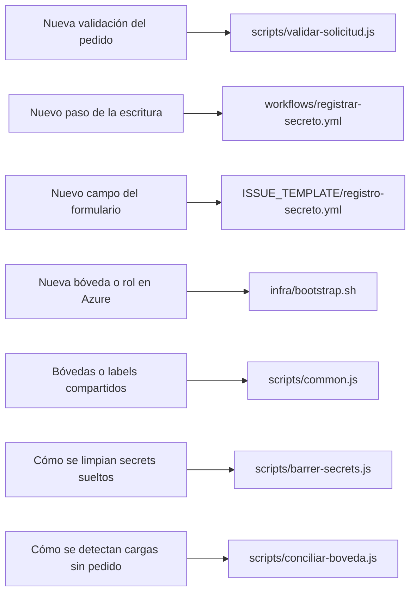

# Contribuir

Lineamientos para trabajar en este repo. Ver [ARCHITECTURE.md](ARCHITECTURE.md) para la estructura y
las decisiones de diseño.

## Requisitos

- **Sin dependencias npm.** No hay `package.json` y no debería haberlo: los scripts usan solo módulos
  nativos de Node y corren sobre el **Node embebido en `actions/github-script`** (no hay `setup-node`).
- **Azure CLI** para correr `infra/bootstrap.sh`. En el runner ya viene instalada; en el step de
  escritura se usa `az` más `jq` (ambos presentes en `ubuntu-latest`).

## Reglas que no se negocian

- **El valor nunca entra por el repo.** Ni por un campo del formulario, ni por un comentario, ni por un
  input del workflow. Se carga **una sola vez** como secret de GitHub `VALOR_ISSUE_<n>` y de ahí lo
  toma el job que escribe.
- **El valor nunca va como argumento de `az`** (`--value` lo dejaría visible con `ps`) **ni a
  `GITHUB_ENV`**: va por un archivo temporal con permisos `600` y `trap` que lo borra, y vive solo en el
  step que lo escribe.
- **La escritura es atómica:** se pre-chequean todos los KV antes de escribir; si uno falla, no se
  escribe en ninguno. No se le da permiso de **borrado** a la identidad que escribe (rompería "quien
  escribe no puede leer ni borrar", y el *soft-delete* dejaría el nombre en la papelera).
- **La identidad que concilia no recibe permiso de escritura.** Corre sin aprobación humana: si pudiera
  escribir, sería una forma de registrar secretos saltándose al analista.
- **Ninguna identidad recibe roles de más.** La de registro tiene `setSecret` + `readMetadata`; la de
  conciliación solo `readMetadata`. El paso que comprueba el `403` por KV existe para que ampliar un
  permiso rompa el registro (con alerta) en vez de pasar inadvertido.
- **Los datos del issue llegan a `run:` solo por `env:`**, nunca interpolados con `${{ }}`.
- **Ninguna clave se versiona**: ni archivos `.pem`, `.key`, `.p12` o `.pfx`. La llave de la GitHub App
  vive como secret del environment `github-app`, nunca en el repo.

## Convenciones de código

- JavaScript con `'use strict'`, sin dependencias externas. Lo compartido va en `scripts/common.js`
  (**sin duplicación**).
- Bash con `set -uo pipefail`, variables siempre entrecomilladas; listas JSON se recorren con `jq`.
- Resultado por **stdout**, todo lo demás por **stderr**.
- Acciones de terceros **ancladas a SHA**, nunca a etiqueta.
- Identificadores en inglés; comentarios en español, cortos.
- Sin linter por ahora: si se agrega uno, se justifica antes.

## Dónde va cada cosa

La lógica vive en `scripts/`, no embebida en el YAML: así queda en el diff y se puede probar aparte
(ver `local/pruebas/std-*`). La lista de bóvedas y el parseo del pedido viven **una sola vez** en
`common.js`: los usan la validación, la escritura y la conciliación.

## Si cambiás el nombre del repo o del dueño

El login contra Azure deja de funcionar: el token que firma GitHub lleva los IDs numéricos, pero la
credencial federada guarda también los nombres. Volvé a correr `infra/bootstrap.sh`: relee el subject
de la API de GitHub y actualiza las credenciales de las dos identidades.

## Cambios que exigen revisión

Modificar `scripts/` o `workflows/` permite exfiltrar el valor, porque el runner tiene salida de red.
Este lab es de un solo dueño y no tiene `CODEOWNERS` ni protección de rama. **En un entorno corporativo
ese control es obligatorio**: PR, aprobación de un code owner y protección de la rama por defecto. Sin
eso, el resto de las defensas de este repo valen poco.
