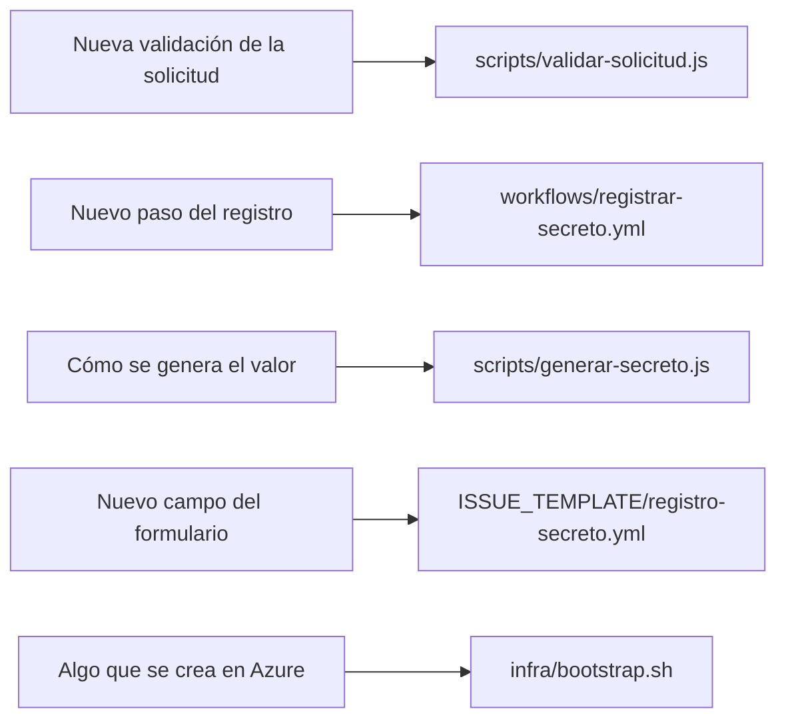

# Contribuir

Lineamientos para trabajar en este repo. Ver [ARCHITECTURE.md](ARCHITECTURE.md) para la estructura y
las decisiones de diseño.

## Requisitos

- **Node 22 LTS** — el workflow la fija con `actions/setup-node`.
- **Azure CLI** para correr `infra/bootstrap.sh`. En el runner ya viene instalada.
- Sin dependencias npm. No hay `package.json` y no debería haberlo.

## Reglas que no se negocian

- **Nadie teclea, pega ni cifra el valor**: lo genera `generar-secreto.js` en el runner. No agregar
  inputs, comentarios ni campos que lo reciban.
- **El valor nunca va como argumento de `az`**: `--value` lo dejaría visible con `ps`. Va por archivo
  temporal con permisos `600` y `trap` que lo borra.
- **El valor nunca va a `GITHUB_ENV`**: vive solo en el step que lo genera.
- **La identidad no recibe roles de más.** Solo `Key Vault Secret Writer (PoC)`. El step que
  comprueba el `403` existe para que ampliarlo rompa el registro en vez de pasar inadvertido.
- **Ninguna clave se versiona**: ni archivos `.pem`, `.key`, `.p12` o `.pfx`.
- **Los datos del issue llegan a `run:` solo por `env:`**, nunca interpolados con `${{ }}`.

## Convenciones de código

- JavaScript con `'use strict'`, sin dependencias externas.
- Bash con `set -euo pipefail` y variables siempre entrecomilladas.
- **Sin duplicación**: lo que comparten los scripts va en `scripts/common.js`.
- Resultado por **stdout**, todo lo demás por **stderr**.
- Acciones de terceros **ancladas a SHA**, nunca a etiqueta.
- Sin linter por ahora: si se agrega uno, se justifica antes.

## Dónde va cada cosa

La lógica vive en `scripts/`, no embebida en el YAML: así queda en el diff y se puede probar aparte.
Nada de Azure se crea a mano por el portal: si no está en `bootstrap.sh`, no existe.

## Si cambiás el nombre del repo o del dueño

El login contra Azure deja de funcionar. GitHub firma el token con los IDs numéricos, pero la
credencial federada guarda también los nombres. Volvé a correr `infra/bootstrap.sh`: lee el subject
de la API de GitHub y la actualiza.

## Cambios que exigen revisión

Modificar `scripts/` o `workflows/` permite exfiltrar el valor, porque el runner tiene salida de red.
Este lab es de un solo dueño y no tiene `CODEOWNERS` ni protección de rama. **En un entorno
corporativo ese control es obligatorio**: PR, aprobación de un code owner y protección de la rama por
defecto. Sin eso, el resto de las defensas de este repo valen poco.
